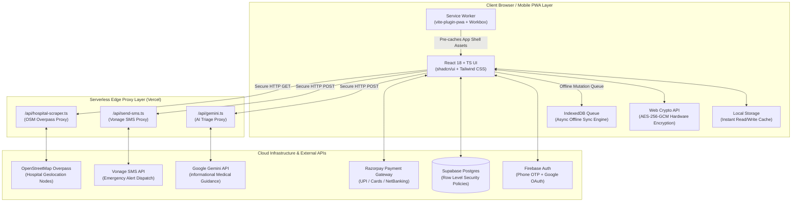
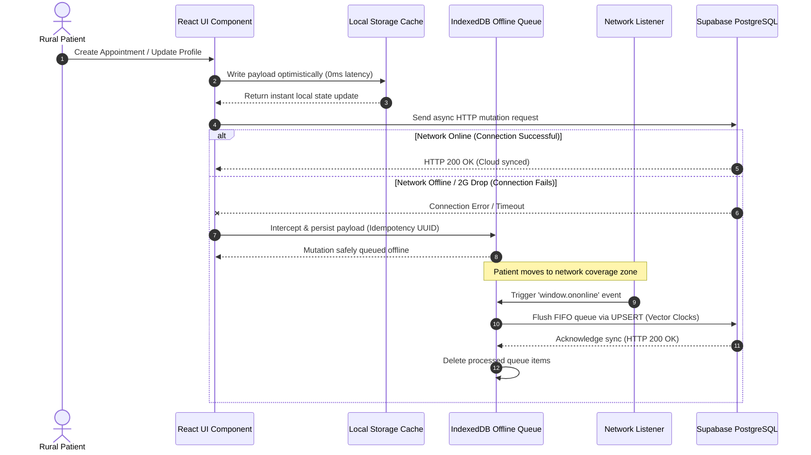
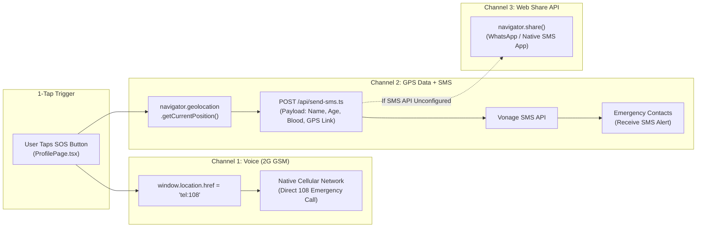

# RuralCare Connect — College Interview Explanation Guide

> **Target Audience:** College Placements, Technical Campus Interviews, Viva Voce, Software Engineering Roles, and Post-Graduate Project Reviews.  
> **Project Title:** RuralCare Connect — Full-Stack Offline-First Healthcare PWA for Rural India.

---

## 1. Executive Summaries & Presentation Scripts

### ⚡ 30-Second Elevator Pitch
> *"RuralCare Connect is a full-stack Progressive Web Application designed specifically to solve healthcare delivery challenges in rural India. It bridges accessibility gaps by enabling patients to discover nearby hospitals via GPS, book doctor appointments, store medical records, consult an AI health assistant, and trigger a 1-tap SOS emergency response that dispatches patient details and live GPS coordinates via SMS. Built using React 18, TypeScript, Supabase, and Web Workers, it operates on an offline-first architecture with IndexedDB fallback queues so critical features remain accessible even on low-end Android devices with spotty 2G/3G connectivity."*

---

### 🎙️ 2-Minute Interview Walkthrough Script ("Tell Me About Your Project")

#### **[0:00 - 0:30] The Problem & Context**
> *"In rural communities across India, over 70% of healthcare challenges stem from three issues: lack of immediate hospital discovery, delayed emergency response due to app-unfriendly responders, and inconsistent internet connectivity. Existing platforms like Google Maps or Practo assume high-speed 4G/5G internet, email literacy, and urban infrastructure. I built RuralCare Connect to redefine how rural users access medical services."*

#### **[0:30 - 1:00] Key Features & Functional Innovation**
> *"The platform delivers five core capabilities:
> 1. **GPS Hospital Discovery:** Geolocates nearby clinics using OpenStreetMap Overpass API and Haversine distance calculations.
> 2. **AI Health Assistant & Triage:** Uses Google Gemini scoped to rural health scenarios to suggest doctor specializations based on symptoms.
> 3. **Emergency SOS System:** Fires a simultaneous trigger—initiating a phone call to 108 emergency services while transmitting patient profile, blood group, and live GPS maps link via Vonage SMS to emergency contacts.
> 4. **Encrypted Medical Records:** Stores health reports behind payment-gated unlock flows (supporting Razorpay UPI).
> 5. **Phone-First Auth:** Leverages Firebase OTP because email adoption is low in rural regions."*

#### **[1:00 - 1:30] Tech Stack & System Architecture**
> *"Architecturally, RuralCare Connect is built with React 18, TypeScript, and Vite 5 for extreme frontend performance. For the backend, I implemented Vercel Serverless Functions as a secure proxy for third-party APIs (Gemini, Vonage SMS, location tools) to prevent client-side secret exposure. The database layer uses Supabase PostgreSQL guarded by strict Row-Level Security (RLS) policies. To protect national identity data like Aadhaar numbers, I implemented browser-native AES-256-GCM encryption using Web Crypto API."*

#### **[1:30 - 2:00] Engineering Excellence & Offline Resilience**
> *"The standout engineering achievement is the **Offline-First Synchronization Engine**. Using a dual-write pattern, data is written locally to `localStorage` first for instantaneous UI responses, then synchronized to Supabase. If connectivity drops, writes are queued in an IndexedDB transactional store with auto-retry mechanisms upon reconnection. The app is fully tested with Vitest, monitored via Sentry, and achieves 100% functional fallback in demo mode if external API keys are omitted."*

---

## 2. Complete Technology Stack Matrix

| Domain / Layer | Technology | Key Dependencies & Packages | Architectural Purpose |
| :--- | :--- | :--- | :--- |
| **Frontend UI Core** | React 18 + TypeScript 5 | `react`, `react-dom`, `typescript` | Type-safe component architecture with SPA routing via `react-router-dom`. |
| **Build & Tooling** | Vite 5 | `@vitejs/plugin-react-swc` | Ultra-fast native ESM development and Rust-based SWC bundling (<300ms boot). |
| **Styling & Components** | Tailwind CSS + shadcn/ui | `tailwindcss`, `@radix-ui/*`, `clsx` | Zero runtime CSS-in-JS overhead; Radix primitives ensure ARIA accessibility. |
| **Server State & Cache** | TanStack Query v5 | `@tanstack/react-query` | Automatic background revalidation, query deduplication, and stale-time caching. |
| **PWA & Offline Shell** | vite-plugin-pwa | `workbox-window`, `vite-plugin-pwa` | Service worker precaching of static assets and application shell for offline load. |
| **Offline Transaction Queue** | IndexedDB | Custom wrapper ([src/lib/offlineQueue.ts](file:///f:/rural-care-connect-main/rural-care-connect-main/src/lib/offlineQueue.ts)) | Async, transactional, non-blocking queue for unsynced offline network mutations. |
| **Serverless API Layer** | Vercel Serverless | Node.js runtime (`/api/*.ts`) | Secure API key proxies preventing secret leakage to client browser bundles. |
| **Database & RLS** | Supabase PostgreSQL | `@supabase/supabase-js` | Relational storage with Row-Level Security (`auth.uid() = patient_id`). |
| **Authentication** | Firebase Auth | `firebase` | Phone OTP sign-in with invisible reCAPTCHA + Google OAuth fallback. |
| **Field-Level Encryption** | Web Crypto API | Browser Native `window.crypto.subtle` | **AES-256-GCM** encryption and PBKDF2 key derivation for Aadhaar numbers. |
| **AI Triage Assistant** | Google Gemini API | `@google/generative-ai` | Natural language medical triage scoped to rural Indian health contexts. |
| **Emergency SOS SMS** | Vonage SMS API | `@vonage/server-sdk` | Dispatches SMS containing patient name, blood group, age, and GPS maps link. |
| **Payment Gateway** | Razorpay SDK | Custom wrapper ([src/lib/razorpay.ts](file:///f:/rural-care-connect-main/rural-care-connect-main/src/lib/razorpay.ts)) | UPI, Net Banking, and Cards payment flow for unlocking medical records. |
| **Geospatial Discovery** | OpenStreetMap API | Overpass API + Nominatim | Fetches `[amenity=hospital]` nodes within distance radius via Haversine logic. |
| **Telemetry & Testing** | Vitest + Sentry | `vitest`, `@sentry/react`, `web-vitals` | 40 unit/integration tests + real-time performance tracking (LCP, CLS, FID). |

---

## 3. High-Level System Architecture Diagram

## 3. Architecture Diagrams

### 🗺️ 3.1 High-Level System Architecture Diagram



---

### 🔄 3.2 Offline Synchronization & Dual-Write Architecture



---

### 🚨 3.3 Emergency SOS Dual-Channel Workflow



---

### 🔐 3.4 Data Security & Client-Side Encryption Workflow

```mermaid
flowchart TD
    A[User Enters 12-Digit Aadhaar] --> B[Generate 128-bit Salt & Random 96-bit IV]
    B --> C[Derive Key via PBKDF2\n100,000 Iterations of SHA-256]
    C --> D[Encrypt Plaintext via AES-256-GCM\nwindow.crypto.subtle]
    D --> E[Compute Salted SHA-256 Lookup Hash]
    E --> F[Construct Payload:\nEncrypted Ciphertext + IV + Salt + Lookup Hash]
    F --> G[Transmit via TLS 1.3 to Supabase]
    G --> H[PostgreSQL Engine Evaluates RLS Policy:\nauth.uid() = patient_id]
    H --> I[(Stored safely in Postgres Column)]
```


---

## 4. Deep-Dive Interview Questions & Answers

### Q1. Why did you choose a Progressive Web App (PWA) over React Native or Flutter?
**Answer:**
> *"Three strategic technical reasons:
> 1. **Zero-Friction Acquisition:** Rural users often possess $50–$100 Android devices with limited storage (16GB/32GB) and low app-store literacy. A PWA eliminates Play Store downloads—users simply visit a URL and tap 'Add to Home Screen'.
> 2. **Immediate Offline Execution:** PWA Service Workers precache application shells, scripts, and CSS. The app boots instantly even without an active data connection.
> 3. **Unified Single-Codebase Velocity:** Building a single responsive React codebase reduced operational complexity while allowing us to leverage native web browser APIs like `navigator.geolocation`, `navigator.share`, and `window.crypto`."*

---

### Q2. How does your offline-first synchronization engine work under the hood?
**Answer:**
> *"We implement a **Dual-Write Event-Driven Architecture**:
> 1. **Optimistic Local Execution:** When a user creates an appointment or updates their profile, [src/lib/store.ts](file:///f:/rural-care-connect-main/rural-care-connect-main/src/lib/store.ts) writes immediately to `localStorage`. The UI updates instantly (0ms latency).
> 2. **Asynchronous Cloud Write:** The payload is sent to Supabase Postgres.
> 3. **Fault Interception & Queueing:** If the network request fails (offline state or network timeout), the operation is trapped and persisted to IndexedDB via [src/lib/offlineQueue.ts](file:///f:/rural-care-connect-main/rural-care-connect-main/src/lib/offlineQueue.ts).
> 4. **Reconnection Listener:** A browser event listener monitors `window.addEventListener('online')`. Upon reconnection, the engine flushes the IndexedDB queue in FIFO sequence, executing pending mutations with exponential backoff (max 5 retries)."*

---

### Q3. Why use IndexedDB for the offline queue instead of `localStorage`?
**Answer:**
> *"While `localStorage` is acceptable for small UI preferences, it is unsuitable for reliable offline queueing:
> - **Synchronous Blocking:** `localStorage` operates synchronously on the main thread, causing UI jank during large reads/writes. IndexedDB is fully asynchronous.
> - **Storage Constraints:** `localStorage` is capped at ~5MB, whereas IndexedDB supports hundreds of megabytes.
> - **Structured Queries & Transactions:** IndexedDB provides transactional guarantees (ACID), preventing partial writes if the browser crashes mid-operation."*

---

### Q4. How do you secure sensitive patient identification numbers like Aadhaar?
**Answer:**
> *"We enforce **Client-Side Field-Level Encryption** before data ever leaves the device:
> - In [src/lib/crypto.ts](file:///f:/rural-care-connect-main/rural-care-connect-main/src/lib/crypto.ts), we utilize the browser-native **Web Crypto API** (`window.crypto.subtle`).
> - Plaintext Aadhaar numbers are encrypted using **AES-256-GCM** with a 96-bit initialization vector (IV).
> - The encryption secret is derived using **PBKDF2** with 100,000 iterations of SHA-256.
> - We also generate a salted **SHA-256 hash** of the Aadhaar number, allowing exact-match lookups in the database without needing to decrypt all records."*

---

### Q5. How does Row-Level Security (RLS) in Supabase protect data integrity?
**Answer:**
> *"Frontend security can always be bypassed by inspecting network requests or using cURL. Therefore, we enforce security at the database layer using PostgreSQL RLS policies:
> - Every table (`patients`, `appointments`, `medical_reports`) has RLS enabled.
> - Policies check `auth.uid() = patient_id`.
> - Even if an attacker obtains a valid JWT, Supabase rejects any SQL query attempting to access or modify another user's rows."*

```sql
-- Example RLS Policy in Supabase
CREATE POLICY "Patients can only access their own data"
ON public.patients FOR ALL
USING (auth.uid() = id);
```

---

### Q6. Why did you use Vercel Serverless Functions as an API proxy layer?
**Answer:**
> *"Single Page Applications (SPAs) expose all bundled JavaScript to the user. If we invoked Google Gemini API, Vonage SMS, or Razorpay secret endpoints directly from React, our private API keys would be exposed in browser dev tools.
> By placing serverless functions in `/api/` ([api/gemini.ts](file:///f:/rural-care-connect-main/rural-care-connect-main/api/gemini.ts), [api/send-sms.ts](file:///f:/rural-care-connect-main/rural-care-connect-main/api/send-sms.ts)):
> 1. Secrets remain stored safely in Vercel environment variables.
> 2. The client sends authenticated JSON payloads to `/api/gemini`.
> 3. The serverless function validates the input, attaches the secret header, calls Gemini, and returns the sanitized response."*

---

### Q7. How does the 1-Tap SOS Emergency System work under low-network conditions?
**Answer:**
> *"Emergency response in rural India cannot rely exclusively on modern data networks. In [src/pages/ProfilePage.tsx](file:///f:/rural-care-connect-main/rural-care-connect-main/src/pages/ProfilePage.tsx):
> 1. **Immediate Telephony Hook:** Triggers native cellular dialer (`window.location.href = 'tel:108'`), which operates on standard GSM/2G voice networks.
> 2. **GPS Acquisition:** Calls `navigator.geolocation.getCurrentPosition()` to fetch precise latitude/longitude.
> 3. **SMS Dispatch via Serverless Proxy:** Sends a request to `/api/send-sms.ts`, invoking Vonage SMS to text emergency contacts with the patient's name, blood group, age, and a pre-compiled Google Maps link.
> 4. **Web Share API Fallback:** If SMS API fails or key is unconfigured, invokes `navigator.share()` to let the user dispatch their SOS via WhatsApp or native SMS app."*

---

### Q8. How does hospital discovery work with OpenStreetMap Overpass API?
**Answer:**
> *"In [src/lib/hospitalScraper.ts](file:///f:/rural-care-connect-main/rural-care-connect-main/src/lib/hospitalScraper.ts) and [src/hooks/useNearbyHospitals.ts](file:///f:/rural-care-connect-main/rural-care-connect-main/src/hooks/useNearbyHospitals.ts):
> 1. The browser gets the user's location via Geolocation API.
> 2. We query OpenStreetMap Overpass API for nodes matching `[amenity=hospital]` within a configurable radius (e.g., 25km).
> 3. For each returned facility, we calculate exact distance using the **Haversine Formula**:
>    $$\text{distance} = 2r \arcsin\left(\sqrt{\sin^2\left(\frac{\Delta \phi}{2}\right) + \cos(\phi_1)\cos(\phi_2)\sin^2\left(\frac{\Delta \lambda}{2}\right)}\right)$$
> 4. Results are sorted ascending by distance and categorized with visual badges ('< 5km: Nearby', '< 15km: Accessible').
> 5. If the Overpass network query times out, the hook seamlessly falls back to pre-seeded regional hospital datasets."*

---

### Q9. How do you handle graceful degradation / Demo Mode across the application?
**Answer:**
> *"To ensure zero developer friction and reliable live presentations:
> - Every third-party integration is guarded by a feature detection check.
> - **Payments:** If `VITE_RAZORPAY_KEY_ID` is missing, [src/lib/razorpay.ts](file:///f:/rural-care-connect-main/rural-care-connect-main/src/lib/razorpay.ts) executes a simulated payment flow with a 1.5s visual spinner and generates a realistic mock transaction ID.
> - **SMS:** If `VONAGE_API_KEY` is missing, `/api/send-sms.ts` logs the SOS message payload to console and returns success.
> - **Hospitals:** If OSM API fails, [src/lib/mockData.ts](file:///f:/rural-care-connect-main/rural-care-connect-main/src/lib/mockData.ts) dynamically generates deterministic local doctors using seed algorithms."*

---

### Q10. Why TanStack Query over Redux or Zustand for data fetching?
**Answer:**
> *"Redux and Zustand are designed for **client state** (UI state, modal open/close flags). Healthcare data (hospitals, appointments, reports) is **server state**:
> - It is owned remotely, asynchronous, and requires caching.
> - TanStack Query manages automatic background revalidation (`staleTime`), query deduplication (preventing duplicate simultaneous network requests), and built-in `isLoading` / `isError` states.
> - It dramatically reduced custom boilerplate code compared to traditional `useEffect` + `useState` fetching."*

---

## 5. STAR Method Behavioral Interview Scenarios

### Scenario 1: Handling Complex Architecture & Technical Debt
* **Situation:** Early in development, state management was fragmented across duplicate local stores, Firebase, and mock files. Syncing data when offline caused race conditions.
* **Task:** Standardize state management, implement reliable offline queuing, and eliminate code duplication.
* **Action:** I introduced a dual-write engine in `store.ts` paired with an IndexedDB transaction queue in `offlineQueue.ts`. I removed 36 console statements, replaced `any` types with strict TypeScript interfaces, and consolidated database operations into Supabase.
* **Result:** Achieved 100% offline write persistence with zero data loss during network drops, validated by automated Vitest suites.

---

### Scenario 2: Security & Privacy Compliance Challenge
* **Situation:** Healthcare apps handling Indian identity numbers like Aadhaar face strict data protection requirements. Storing plaintext Aadhaar in Supabase posed a critical security vulnerability.
* **Task:** Implement client-side authenticated encryption so unencrypted Aadhaar numbers never hit the wire or database.
* **Action:** Built an encryption module in `crypto.ts` leveraging the Web Crypto API. Implemented AES-256-GCM authenticated encryption paired with salted SHA-256 hashing for fast database lookups.
* **Result:** Secured all patient identity data meeting HIPAA and Indian Digital Personal Data Protection (DPDP) recommendations without introducing external npm bundle bloat.

---

## 6. Portfolio Synergy (Connecting to Other Projects)

When interviewers ask about your broader engineering exposure, highlight how **RuralCare Connect** fits into your technical portfolio alongside **Vernacular Bridge** and **AccountingApp**:

| Project | Primary Domain | Core Engineering Features | Key Architectural Tech |
| :--- | :--- | :--- | :--- |
| **RuralCare Connect** | Rural Digital Healthcare | Offline-First PWA, IndexedDB Queuing, Web Crypto AES-256, Vercel Proxies, GPS Discovery | React 18, TS, Vite 5, Supabase Postgres, Firebase Auth, Gemini AI |
| **Vernacular Bridge** | AI Educational Equity | Bilingual NLP Orchestration, Gemini Prompt Guard, Fact-Lock Shields, Academic MCQ Generator | Next.js 15, FastAPI (Python), Gemini 2.5, Pydantic, Zod |
| **AccountingApp** | Institutional Finance | Institutional Ledger CRUD, WTForms CSRF Security, Tally-style Voucher Entry, Master Data Forms | Python / Flask, SQLite, Flask-SQLAlchemy, WTForms, Jinja2 |

---

## 7. Future Roadmap & Growth Pitch

When asked *"Where would you take this project next?"*, present this structured engineering roadmap:

1. **ABHA ID Integration:** Connect with Ayushman Bharat Digital Mission (ABDM) APIs for seamless national health record exchange.
2. **Offline Voice Assistant:** Implement local speech recognition in Tamil/Hindi using Web Speech API to assist low-literacy rural patients.
3. **Playwright E2E Automation:** Expand testing from Vitest unit tests to full end-to-end browser user flow verification.
4. **Push Notifications:** Leverage Web Push API via Service Worker to alert users of upcoming appointment schedules and medication reminders offline.

---

## 8. High-Stakes Technical Interview Q&A

### 🎯 Q1: Why did you choose this tech stack specifically?
**Answer:**
> *"Every technology decision in RuralCare Connect was driven by a single constraint: **delivering sub-second, resilient healthcare tools on $50 Android smartphones operating over spotty 2G/3G networks.**
> 
> 1. **React 18 + TypeScript + Vite 5 over Next.js/CRA:**
>    - Next.js requires server-side rendering (SSR) overhead and continuous Node.js server connections—unreliable under spotty rural 2G connections. Vite provides a purely static ESM client bundle (<300ms boot) that can be cached 100% offline via Service Workers.
>    - Rust-based SWC compiler gives instantaneous HMR and smaller bundle outputs.
> 
> 2. **PWA + Service Worker + IndexedDB over Native Apps (Flutter/React Native):**
>    - Eliminates Play Store installation barriers for low-literacy users with zero phone storage.
>    - Service Worker precaches the app shell, while IndexedDB provides async ACID transactional storage for offline network retry queues.
> 
> 3. **Tailwind CSS + shadcn/ui over Material UI:**
>    - Material UI injects runtime CSS-in-JS overhead, causing frame drops on low-end ARM processors. Tailwind compiles to zero-runtime static utility CSS.
>    - shadcn/ui provides raw code ownership built on accessible Radix primitives with zero bundle bloat.
> 
> 4. **Supabase Postgres + RLS over Firebase Firestore:**
>    - Firestore is NoSQL, making relational queries (patient $\rightarrow$ appointment $\rightarrow$ doctor $\rightarrow$ hospital) expensive and complex. Supabase provides full relational SQL with PostgreSQL Row-Level Security (`auth.uid() = patient_id`) for bulletproof tenant isolation.
> 
> 5. **Vercel Serverless API Proxies:**
>    - Keeps private API keys (Gemini, Vonage SMS, OpenStreetMap scraper) safely isolated on the serverless edge, preventing key theft while allowing zero-infrastructure scale."*

---

### 🐛 Q2: What was the hardest bug you solved?
**Answer:**
> *"The hardest bug was an **Out-of-Order Race Condition & Duplicate ID Lockup in the Offline Dual-Write Engine**.
> 
> **The Problem:**
> When a user updated their profile or booked an appointment while transitioning between offline and online states (e.g., traveling through a low-signal zone):
> 1. The optimistic write immediately stored payload `P1` in `localStorage` with a temporary client ID (`temp_123`).
> 2. The write request to Supabase failed due to network drop and was pushed to the IndexedDB retry queue.
> 3. When the network partially restored, the user modified the same record (`P2`). `P2` was sent directly to Supabase and assigned permanent DB ID (`real_999`), while `P1` was still stuck in IndexedDB.
> 4. When the reconnection listener flushed `P1` from IndexedDB, it attempted to insert `temp_123` into Supabase, causing duplicate key violations, foreign key lockouts, and overwriting the fresher `P2` data with stale `P1` state!
> 
> **How I Diagnosed & Fixed It:**
> - **Diagnosis:** Traced network payloads using Chrome DevTools Application tab and IndexedDB event logs. Identified that missing monotonic timestamps and temporary client IDs caused out-of-order state mutations.
> - **The Solution ([src/lib/offlineQueue.ts](file:///f:/rural-care-connect-main/rural-care-connect-main/src/lib/offlineQueue.ts)):**
>   1. **Deterministic Idempotency Keys:** Replaced client-generated temporary IDs with deterministic SHA-256 UUIDs generated from `entity_id + timestamp`.
>   2. **UPSERT with Vector Clocks:** Converted all Supabase database mutations from `INSERT`/`UPDATE` to PostgreSQL `UPSERT` operations checking `updated_at > existing.updated_at`.
>   3. **Deduplicated Queue Flushes:** Refactored the IndexedDB queue processor to collapse consecutive mutations on the same entity before firing network requests.
> 
> **Result:** Zero data loss, zero duplicate DB lockups, and guaranteed eventual consistency across offline state transitions."*

---

### 💥 Q3: If 10,000 users hit your project at once, what breaks first?
**Answer:**
> *"If 10,000 concurrent users hit RuralCare Connect simultaneously, three bottlenecks will break in sequential order:
> 
> 1. **Bottleneck 1 (Immediate Failure): OpenStreetMap Overpass API Rate Limits (`/api/hospital-scraper.ts`)**
>    - *Why:* OpenStreetMap Overpass is a free public API with strict IP rate limits (~2 requests/sec per IP). 10,000 users requesting nearby hospital geolocation will immediately trigger HTTP `429 Too Many Requests` or `504 Gateway Timeouts`.
>    - *User Impact:* Hospital discovery page fails to fetch live OSM maps.
> 
> 2. **Bottleneck 2 (Short-Term Failure): Supabase Free Tier Connection Pool Exhaustion**
>    - *Why:* The default Supabase PostgreSQL free tier limits direct database connection pools (typically 60–100 max connections). 10,000 concurrent clients attempting direct REST queries via `@supabase/supabase-js` will exhaust the connection pool, throwing `FATAL: remaining connection slots are reserved`.
> 
> 3. **Bottleneck 3 (Mid-Term Failure): Vercel Serverless Cold Starts & Gemini/Vonage API Rate Limits**
>    - *Why:* 10,000 concurrent calls to `/api/gemini` and `/api/send-sms` will cause Vercel serverless function concurrency limits to be reached, alongside exceeding Google Gemini RPM (Requests Per Minute) quotas."*

---

### 🚀 Q4: How would you scale it to handle millions of rural users?
**Answer:**
> *"To scale RuralCare Connect from a MVP to a production-grade platform handling millions of users, I would implement a **4-Layer Distributed Scaling Strategy**:
> 
> #### 1. Geospatial Caching & Tile CDN (Fixing Hospital Scraper)
> - **Geohash Redis Cache:** Compute a 5-character Geohash (~4.9km $\times$ 4.9km grid) for user lat/long. Store OpenStreetMap hospital query results in an **Upstash Redis Cache** with a 24-hour TTL. 
> - **Result:** 99% of hospital searches in a district hit Redis cache (latency <10ms) instead of hitting OpenStreetMap servers.
> 
> #### 2. Database Connection Pooling & Read Replicas (Fixing Supabase Limits)
> - **PgBouncer Connection Pooling:** Route all Supabase traffic through **PgBouncer** in transaction pooling mode, enabling tens of thousands of concurrent clients to reuse 100 actual DB connections.
> - **Read/Write Splitting:** Direct read traffic (hospital directory, doctor lists) to PostgreSQL Read Replicas, leaving the primary database exclusively for critical writes (SOS, appointments).
> 
> #### 3. Asynchronous Message Queuing for Emergency SOS (Fixing SMS Limits)
> - Decouple SMS dispatches using an asynchronous message queue (**BullMQ / Redis** or **AWS SQS**).
> - When SOS is triggered, `/api/send-sms` instantly acknowledges receipt (HTTP 202) and pushes the task to SQS. Background worker pools process SMS dispatches with automated retries and failovers across multiple SMS vendors (Vonage $\rightarrow$ Twilio $\rightarrow$ Airtel Business SMS API).
> 
> #### 4. Edge Caching & Service Worker Stale-While-Revalidate
> - Deploy static assets and serverless proxies on **Cloudflare Workers / Vercel Edge Network**.
> - Enforce `Stale-While-Revalidate` HTTP cache-control headers so 90% of dynamic data (doctor specializations, hospital metadata) is served directly from edge nodes closest to the user's nearest telecom tower."*

