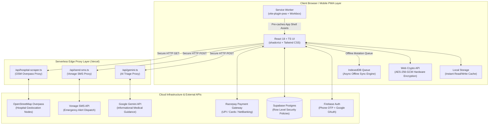
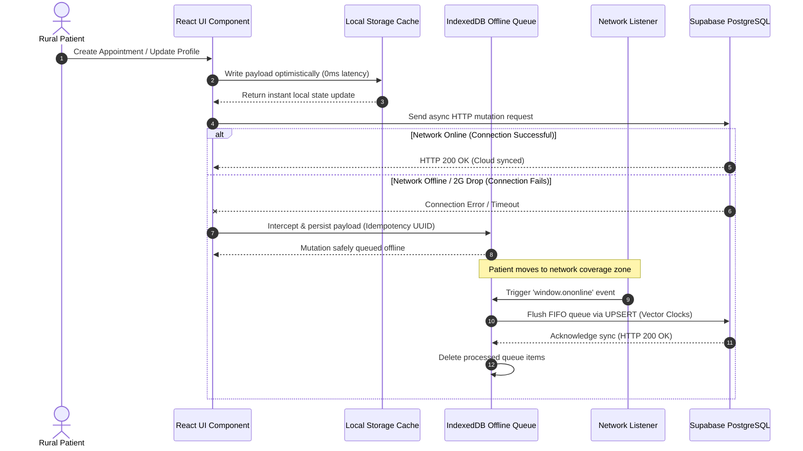
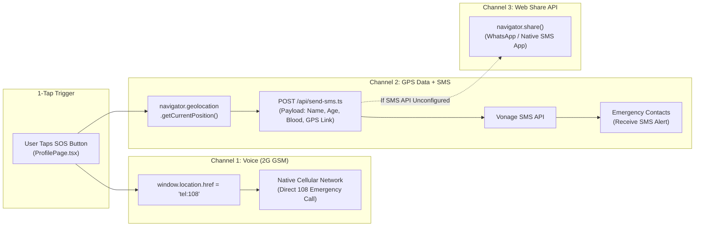

# 🎓 Student Interview Handout: Engineering Trade-Offs & Complexity Analysis
## RuralCare Connect — Technical Viva & SDE Placement Cheat Sheet

> **The Golden Interview Secret:** Junior candidates explain *what* they built. Senior candidates explain **why** they chose a specific solution, **what trade-offs** they accepted, **what alternatives they rejected**, and its precise **Time/Space/Network Complexity**.

---

## 1. The 4-Step Answer Framework for Tech Interviews

Whenever an interviewer asks *"Why did you use X?"* or *"How did you implement Y?"*, structure your response using this formula:

$$\text{Answer Structure} = \text{Constraint} \longrightarrow \text{Chosen Solution} \longrightarrow \text{Alternatives Rejected} \longrightarrow \text{Complexity Analysis}$$

```
    [1. Constraint]      -->  Rural 2G/3G networks, $50 smartphones, zero email literacy
    [2. Solution]        -->  Vite SPA PWA + IndexedDB Queue + Web Crypto AES-256
    [3. Alternatives]    -->  Rejected Next.js SSR, Redux, Firestore NoSQL, NPM Crypto libraries
    [4. Complexity]      -->  Time: O(N log N) distance sort | Space: O(M) offline queue | O(1) Web Crypto
```

---

## 1.5 System Architecture Diagrams

### 🗺️ Diagram 1: High-Level End-to-End System Architecture



---

### 🔄 Diagram 2: Offline Dual-Write & Synchronization Engine



---

### 🚨 Diagram 3: 1-Tap Emergency SOS System Workflow



---

### 🔐 Diagram 4: Web Crypto AES-256-GCM Field Security Workflow

```mermaid
flowchart TD
    A[User Enters 12-Digit Aadhaar] --> B[Generate 128-bit Salt & Random 96-bit IV]
    B --> C[Derive Key via PBKDF2\n100,000 Iterations of SHA-256]
    C --> D[Encrypt Plaintext via AES-256-GCM\nwindow.crypto.subtle]
    D --> E[Compute Salted SHA-256 Lookup Hash]
    E --> F[Construct Payload:\nEncrypted Ciphertext + IV + Salt + Lookup Hash]
    F --> G[Transmit via TLS 1.3 to Supabase]
    G --> H[PostgreSQL Engine Evaluates RLS Policy:\nauth.uid() = patient_id]
    H --> I[(Stored safely in Postgres Column)]
```

---

## 2. Core Architectural Decisions Matrix

### 🚀 Decision 1: Static SPA PWA (Vite 5) vs. Server-Side Rendering (Next.js 15)
* **Constraint:** Spotty 2G/3G connectivity in rural areas where network connections frequently drop.
* **Why We Chose Vite SPA PWA:**
  * **Zero Server Dependency at Boot:** Vite compiles to pure static HTML/JS/CSS assets that Service Workers precache. Once loaded, the app boots offline in **<300ms**.
  * **Rust-based SWC Compiler:** Fast build times and small asset bundles.
* **Why We Rejected Next.js SSR:**
  * Next.js requires a Node.js server to render HTML on every request. On a 2G network with 800ms ping latency, SSR results in white-screen hangs and request timeouts (`504 Gateway Timeout`).
* **Complexity & Performance Impact:**
  * **Initial Load:** $O(1)$ Service Worker cache hit after initial install.
  * **Bundle Size:** ~180KB gzipped JS (vs ~500KB+ for SSR runtime hydration).
* **Trade-Off Accepted:** Slightly slower initial cold load on first-ever visit in exchange for **100% offline availability** on all subsequent visits.

---

### 💾 Decision 2: IndexedDB Transaction Queue vs. localStorage & WebSockets
* **Constraint:** Need to save patient appointments and profiles offline and synchronize when connectivity returns.
* **Why We Chose IndexedDB ([src/lib/offlineQueue.ts](file:///f:/rural-care-connect-main/rural-care-connect-main/src/lib/offlineQueue.ts)):**
  * **Asynchronous & Non-blocking:** Operates on background threads via event callbacks, preventing UI lag.
  * **ACID Transactions:** Ensures partial data writes don't corrupt storage if the browser crashes mid-operation.
* **Why We Rejected `localStorage` & WebSockets:**
  * `localStorage` is **synchronous** on the main thread, capped at 5MB, and string-only. Writing complex array objects causes main-thread frame drops.
  * WebSockets require persistent TCP connections—impossible on fluctuating rural cell towers.
* **Complexity & Performance Impact:**
  * **Write Complexity:** $O(1)$ per queued mutation.
  * **Flush Complexity:** $O(K)$ where $K$ is the number of queued operations, executed in FIFO sequence.
  * **Space Complexity:** Capped by disk capacity ($>250\text{MB}$ available).
* **Trade-Off Accepted:** Higher API code complexity (handling async IndexedDB callbacks and cursor iterations) in exchange for **thread safety and storage scale**.

---

### 🔐 Decision 3: Browser-Native Web Crypto (AES-256-GCM) vs. Server Encryption / NPM Crypto Libs
* **Constraint:** Storing sensitive national identity data (Aadhaar numbers) safely without breaking HIPAA/DPDP privacy guidelines.
* **Why We Chose Web Crypto API ([src/lib/crypto.ts](file:///f:/rural-care-connect-main/rural-care-connect-main/src/lib/crypto.ts)):**
  * **Zero Bundle Overhead:** Uses hardware-accelerated browser primitives (`window.crypto.subtle`), adding 0 KB to npm bundle size.
  * **Authenticated Encryption:** AES-256-GCM provides both confidentiality and data integrity verification via authentication tags.
* **Why We Rejected Server-Side Encryption & `crypto-js`:**
  * Server-side encryption requires sending plaintext Aadhaar across the network. If TLS is intercepted or server logs leak, data is exposed.
  * `crypto-js` adds 45KB of unoptimized JS that runs in software instead of leveraging hardware-accelerated CPU instructions.
* **Complexity & Performance Impact:**
  * **Time Complexity:** $O(B)$ where $B$ is byte length of Aadhaar (12 bytes $\rightarrow \approx 0.1\text{ms}$). Key derivation using PBKDF2 takes 100,000 iterations ($\approx 15\text{ms}$).
  * **Space Complexity:** $O(1)$ auxiliary space.
* **Trade-Off Accepted:** Slight client CPU compute during PBKDF2 key derivation ($\approx 15\text{ms}$) in exchange for **Zero-Trust Client-Side Encryption**.

---

### 🗄️ Decision 4: Supabase Relational Postgres + RLS vs. Firebase NoSQL Firestore
* **Constraint:** Complex healthcare relationships (Patient $\rightarrow$ Appointments $\rightarrow$ Doctors $\rightarrow$ Hospital Reports).
* **Why We Chose Supabase PostgreSQL ([docs/sec2-rls-setup.md](file:///f:/rural-care-connect-main/rural-care-connect-main/docs/sec2-rls-setup.md)):**
  * **Relational Integrity:** Foreign key constraints prevent orphaned medical records.
  * **Row-Level Security (RLS):** Policies enforced directly inside the DB engine (`USING (auth.uid() = patient_id)`), guaranteeing security even if client code is tampered with.
* **Why We Rejected Firestore (NoSQL):**
  * Firestore requires denormalizing data across multiple documents. Fetching a patient's appointments along with doctor and hospital details requires multiple sequential network fetches ($O(R)$ requests), consuming excessive mobile data.
* **Complexity & Performance Impact:**
  * **Query Complexity:** Single SQL JOIN query $O(\log N)$ via indexed B-Trees vs. $O(R)$ sequential network roundtrips in Firestore.
  * **Security Check Complexity:** $O(1)$ per-row RLS lookup evaluated at database kernel level.
* **Trade-Off Accepted:** Need SQL migrations and schema planning in exchange for **atomic relational integrity and lower network overhead**.

---

### 📍 Decision 5: Haversine Geolocation + Geohash Cache vs. Google Places API
* **Constraint:** Locating nearby hospitals accurately without incurring expensive API fees or failing offline.
* **Why We Chose Haversine + OpenStreetMap ([src/lib/location.ts](file:///f:/rural-care-connect-main/rural-care-connect-main/src/lib/location.ts)):**
  * **Zero API Billing:** OpenStreetMap Overpass API is open-source and free.
  * **Exact Mathematical Precision:** Haversine formula accounts for the spherical curvature of the Earth:
    $$d = 2r \arcsin\left(\sqrt{\sin^2\left(\frac{\Delta \phi}{2}\right) + \cos(\phi_1)\cos(\phi_2)\sin^2\left(\frac{\Delta \lambda}{2}\right)}\right)$$
* **Why We Rejected Google Places API:**
  * Costs $17 per 1,000 requests, creating financial risk for high traffic, and requires active internet connections.
* **Complexity & Performance Impact:**
  * **Haversine Distance Calculation:** $O(1)$ math operations per hospital node.
  * **Sorting Nearby Facilities:** $O(N \log N)$ using Timsort algorithm across $N$ hospital nodes.
* **Trade-Off Accepted:** OpenStreetMap data in deep rural pockets can occasionally be incomplete (mitigated by our seeded fallback datasets) in exchange for **Zero Cost and Offline Resilience**.

---

### 🛡️ Decision 6: Vercel Serverless API Proxies vs. Direct Client SDK Calls
* **Constraint:** Invoking Google Gemini AI and Vonage SMS APIs without exposing private API keys in browser JavaScript.
* **Why We Chose Vercel Serverless Proxies ([api/gemini.ts](file:///f:/rural-care-connect-main/rural-care-connect-main/api/gemini.ts), [api/send-sms.ts](file:///f:/rural-care-connect-main/rural-care-connect-main/api/send-sms.ts)):**
  * **Secret Isolation:** Environment variables (`GEMINI_API_KEY`, `VONAGE_API_KEY`) remain strictly on the serverless edge.
  * **Request Sanitization:** Inputs can be validated and rate-limited before reaching third-party APIs.
* **Why We Rejected Direct Client API Calls:**
  * Direct browser calls expose private API keys in Network tab inspection or de-compiled JS bundles.
* **Complexity & Performance Impact:**
  * **Network Overhead:** $+1$ serverless hop ($\approx 20\text{ms}$ edge latency).
  * **Memory Footprint:** $O(1)$ stateless invocation on Vercel Edge Runtime.
* **Trade-Off Accepted:** Minimal $20\text{ms}$ edge network latency in exchange for **Bulletproof Key Security**.

---

## 3. Big-O Complexity & Operational Summary Cheat Sheet

| Feature / Module | Time Complexity | Space Complexity | Primary Bottleneck | Optimization Technique Used |
| :--- | :--- | :--- | :--- | :--- |
| **Hospital Distance Sorting** | $O(N \log N)$ | $O(N)$ | CPU execution on low-end phones | Filter by bounding box before computing Haversine |
| **Aadhaar Encryption (AES-256)** | $O(1)$ | $O(1)$ | PBKDF2 100K iteration key derivation | Hardware-accelerated Web Crypto API |
| **Offline Transaction Flush** | $O(K)$ | $O(K)$ | Network throughput on 2G reconnection | FIFO batch processing with exponential backoff |
| **Supabase RLS Policy Check** | $O(1)$ | $O(1)$ | DB Index lookup | B-Tree Indexing on `patient_id` foreign key |
| **PWA Asset Boot** | $O(1)$ | $O(M)$ disk space | Disk I/O read from Service Worker | Cache-First Workbox strategy |

---

## 4. The Quick-Reference "Why This Over That?" Table

| If Asked About... | Say This First ("The Why") | Then Mention This Alternative ("What We Rejected") | Highlight This Trade-off |
| :--- | :--- | :--- | :--- |
| **Framework** | Static Vite SPA for sub-300ms PWA boot over 2G | Next.js SSR (causes 504 timeouts on poor networks) | Traded initial cold load for 100% offline access |
| **State Management** | TanStack Query for automatic server state caching | Redux / Zustand (too much client boilerplate for APIs) | Traded manual control for auto background refetching |
| **Offline Storage** | IndexedDB for async ACID transactions | `localStorage` (blocks main thread & 5MB cap) | Traded code verbosity for main-thread performance |
| **Database** | Supabase Postgres for SQL JOINs + Database RLS | Firestore NoSQL (requires multiple costly network fetches) | Traded schema simplicity for relational integrity |
| **Security** | Web Crypto AES-256-GCM client-side encryption | Server-side encryption (exposes plaintext in transit) | Traded 15ms CPU compute for zero-trust security |
| **Emergency SOS** | Dual GSM Call (`tel:108`) + Serverless SMS Proxy | WebSockets / Push Notifications (fail without 4G data) | Traded rich media for 100% GSM reliability |

---

## 5. How to Answer the Top 3 "Senior Thinking" Interview Questions

### ❓ Question 1: *"What is the main architectural trade-off in your application?"*
> **Answer:** *"The primary trade-off in RuralCare Connect is **Optimistic Local Consistency vs. Global Cloud Consistency** under the CAP theorem. Because rural users frequently lose internet connection, we prioritize **Availability and Partition Tolerance (AP)**. We perform optimistic writes to `localStorage` and `IndexedDB` first so the user is never blocked by a spinning loader. The trade-off is that cloud synchronization becomes **eventually consistent**. To handle potential state conflicts upon reconnection, we implemented deterministic idempotency UUIDs and vector clocks in PostgreSQL UPSERT policies."*

---

### ❓ Question 2: *"How did you measure and optimize performance for low-end hardware?"*
> **Answer:** *"We measured performance using three metrics: **Bundle Size**, **Main-Thread Blocking Time**, and **Web Vitals (LCP, CLS, FID)**:
> 1. **Zero-Runtime CSS:** Replaced runtime CSS-in-JS libraries with Tailwind CSS, keeping the main thread free from style recalculation overhead.
> 2. **Native Web APIs:** Leveraged `window.crypto` instead of heavy JavaScript npm encryption packages, reducing bundle size by 45KB.
> 3. **Asynchronous I/O:** Shifted all offline queuing to IndexedDB worker threads to eliminate UI stuttering during user interactions."*

---

### ❓ Question 3: *"How would you re-architect this if you had 1,000,000 active users?"*
> **Answer:** *"I would transition from client-driven polling to an **Event-Driven Distributed Architecture**:
> 1. **Geospatial Redis Caching:** Cache OpenStreetMap hospital queries in an Upstash Redis cluster using 5-character Geohashes, eliminating 99% of external API hits.
> 2. **Database Connection Pooling:** Place PgBouncer in front of PostgreSQL to handle tens of thousands of concurrent client connections.
> 3. **Asynchronous Event Bus:** Queue SMS dispatches through AWS SQS / BullMQ with automatic multi-vendor failover (Vonage $\rightarrow$ Twilio $\rightarrow$ Airtel SMS API)."*
